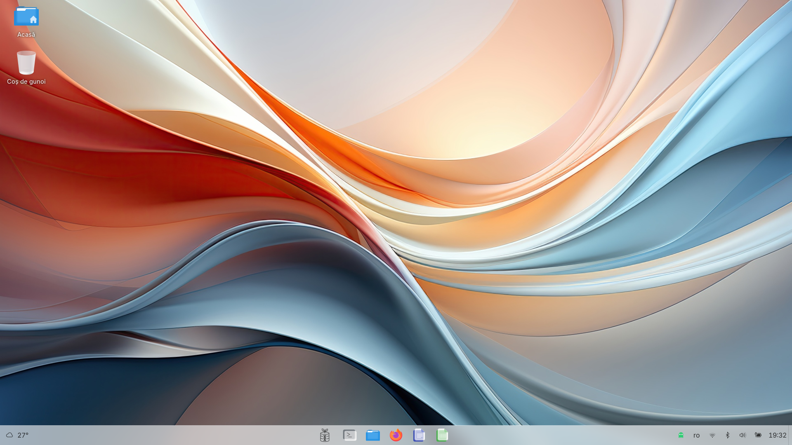
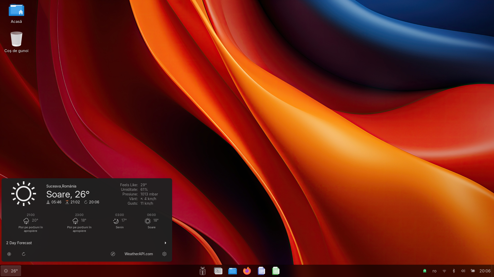
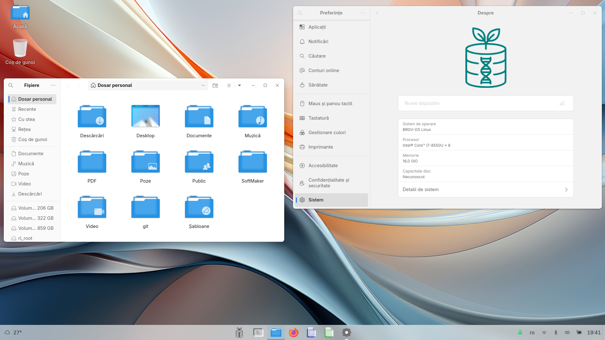
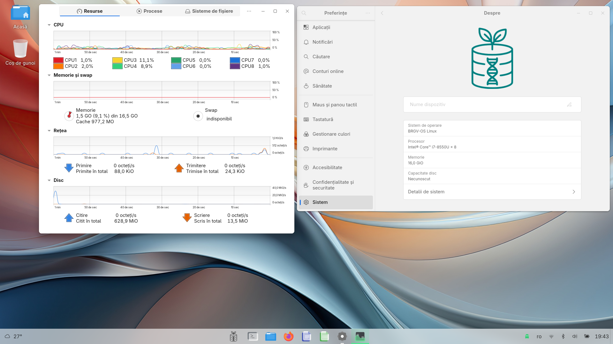

# $\textcolor{cyan}{\texttt{ {BRGV-OS}}}$ [](https://sourceforge.net/projects/brgv-os/files/brgv-os-2025/) [](https://sourceforge.net/projects/brgv-os/) 


**BRGV-OS** is a custom [Void Linux](https://voidlinux.org/) based distribution that aims to facilitate developers, researchers and users to transitioning from Windows&#174; or macOS&#174; to Linux&#174; by maintaining familiar operational habits and workflows.  
This work was do it for our job needs at Gene Bank research institute from Suceava, Romania, but anyone can use or modify for their needs.  
The name **BRGV** is an acronym from Romanian "**B**anca de **R**esurse **G**enetice **V**egetale" (shortly in English Gene Bank), and **OS** mean, of course, **O**perating **S**ystem.  
  
|                     Theme Light                                     |                         Theme Dark                               |
|:-------------------------------------------------------------------:|:----------------------------------------------------------------:|
|||

|                                                        |                                                        |
|:------------------------------------------------------:|:------------------------------------------------------:|
|||

**BRGV-OS** have now 10 themes, 2 for users what prefers classical style and 8 for the users what prefers Unix&#174; style, look at next movie:  
    

[](https://www.youtube.com/embed/EDnMTKS-B8k?autoplay=1&mute=1)

For theme management I wrote the following extensions, scripts and menus:

* [Accent gtk theme](https://extensions.gnome.org/extension/8497/accent-gtk-theme/), it is a `Gnome™` extension that changes the gtk app theme, based on the accent color chosen by the user in `Gnome Settings`, `Appearance screen` and by preferred `color schema`, `Light` or `Dark`, source code [here](https://github.com/florintanasa/accent-gtk-theme);
* [Accent icons theme](https://extensions.gnome.org/extension/8499/accent-icons-theme/), it is a `Gnome™` extension that changes the icons themes, based on the `accent color` chosen by the user in `Gnome Settings` (gnome-control-center), `Appearance` screen and by preferred `color schema`, `Light` or `Dark`, source code [here](https://github.com/florintanasa/accent-icons-theme);
* [Accent user theme](https://extensions.gnome.org/extension/8498/accent-user-theme/), it is a `Gnome™` extension that changes the user's theme based on the accent color chosen by the user in `Gnome Settings`, `Appearance` screen and by preferred `color schema`, `Light` or `Dark`, source code [here](https://github.com/florintanasa/accent-user-theme);
* [Light/Dark cursor theme](https://extensions.gnome.org/extension/8496/lightdark-cursor-theme/), it is a `Gnome™` extension that changes the cursor themes, based on the preferred `color schema`, `Light` or `Dark`, source code [here](https://github.com/florintanasa/light-dark-cursor-theme);
* And 10 [scripts](https://github.com/florintanasa/brgvos-void/tree/main/includedir/usr/local/bin), these are called by 10 [menus](https://github.com/florintanasa/brgvos-void/tree/main/includedir/usr/local/share/applications).
  
Also **BRGV-OS** have another extension [Set Notification Banner Position](https://extensions.gnome.org/extension/8495/set-notification-banner-position/), it is a `Gnome™` extension that changes the position of the banner notification on the sreen, source code [here](https://github.com/florintanasa/set-notification-position).

## $\textcolor{teal}{\texttt{How to build}}$

It is suggested to use **Void Linux** or an others based on this distribution, also **BRGV-OS** work :)  
Default start the build for Romanian language, if you wish to build for international English USA language edit file `locale` and change from `ro_RO.UTF-8` to `en_US.UTF-8` and also edit file `keymap` and change from `ro` to `us`.  
That's it.  
If you wish to build for your language, take a look at file `build_brgvos.sh` how I do it from English USA language and Romanian language.
To build the iso image, it is necessary to use a based **Void Linux** distribution or **BRGV-OS** (is a spin **Void Linux**) where we run next commands:  

```bash
git clone --recurse-submodules https://github.com/florintanasa/brgvos-void.git
cd brgvos-void
sudo ./build_brgvos.sh
```  
  
After that, if everything works ok, we find the iso image is in directory `iso build`.
  
> [!IMPORTANT]  
> In this moment the build is for ro_RO (Romanian language) and en_US (English USA language) , but with few modifications can be buildid for anothers.  
> Exist iso images files for: ro_RO.UTF-8 and en_US.UTF-8.  
> ISO files can be downloaded from:  
> here [](https://sourceforge.net/projects/brgv-os/files/brgv-os/ro_RO/BRGV-OS_gnome_ro_RO.UTF-8_x86_64_26022026_100821.iso/download) for **ro_RO** versions   
> or  
> here [](https://sourceforge.net/projects/brgv-os/files/brgv-os/en_US/BRGV-OS_gnome_en_US.UTF-8_x86_64_26022026_101815.iso/download) for **en_US** version   
> and  
> SHA256 files can be downloaded from:  
> here [](https://sourceforge.net/projects/brgv-os/files/brgv-os/ro_RO/BRGV-OS_gnome_ro_RO.UTF-8_x86_64_26022026_100821.sha256/download) for **ro_RO** versions  
> or  
> here [](https://sourceforge.net/projects/brgv-os/files/brgv-os/en_US/BRGV-OS_gnome_en_US.UTF-8_x86_64_26022026_101815.sha256/download) for **en_US** version 
    
> [!NOTE]  
> News [here](NEWS.md)  
> The installer has reached version 0.31 and in next, long tutorial, video you see what are news. 
>
>[](https://www.youtube.com/embed/97oNxKHYxr4?autoplay=1&mute=1)
> 
>Since the installer is a separate project, I decided to start a new repository at https://github.com/florintanasa/brgvos-installer where you can find more information about it and the installation modes. 
  
> [!TIP]  
> ### $\textcolor{cyan}{\texttt{In \textcolor{red}{\textit{Live Medium}} exist 2 users \textcolor{red}{\textit{root}} and \textcolor{red}{\textit{brgvos}} with the same password \textcolor{red}{\textit{voidlinux}}}}$
>
>
> ### $\textcolor{green}{\texttt{For passphrase, on encrypted partitions, is used user password}}$  
>
>
> ### $\textcolor{orange}{\texttt{For how to install, configure and use the BRGV-OS read on}}$ [Wiki](https://github.com/florintanasa/brgvos-void/wiki) 
  
>[!NOTE]  
> Is not in plan to create an iso for each language, because, in my opinion, it is a waste of energy, human and physical (bandwidth consumption, electricity, etc.), to manage a multitude of iso images.  
> The next approach will be to use scripts for each language and which:
> * will add support for the respective language to the system;
> * will modify the menu with the appropriate translation;
> * will add the corresponding keyboard;
> * will apply the changes to the entire system;
> * will apply the changes to the user only;
> * will apply the changes to the entire system and the user.
>
> Will ensure the transition from one language to another through English.
>
> If you wish to contribuite look at next [link](https://github.com/florintanasa/utils/tree/main/patch)  
> In the following link is a [video demonstration](https://youtu.be/pN8bdZ6Hw88).

## $\textcolor{teal}{\texttt{License}}$

This project is licensed under the GNU GENERAL PUBLIC LICENSE - see the [LICENSE](LICENSE) file for details

## $\textcolor{red}{\texttt{Warning}}$ 

The open-source software included in **BRGV-OS** is distributed in the hope that it will be useful, but **WITHOUT ANY WARRANTY**.  
  
## $\textcolor{teal}{\texttt{The following "ingredients" are also included in BRGV-OS}}$
  
https://github.com/vinceliuice/Fluent-gtk-theme  
https://github.com/vinceliuice/Fluent-icon-theme  
https://github.com/vinceliuice/WhiteSur-gtk-theme  
https://github.com/vinceliuice/WhiteSur-icon-theme  
https://github.com/vinceliuice/MacTahoe-gtk-theme  
https://github.com/vinceliuice/MacTahoe-icon-theme  
https://github.com/ohmybash/oh-my-bash  
https://github.com/scopatz/nanorc  
https://github.com/CarterLi/maple-font  
https://github.com/ryanoasis/nerd-fonts  
https://github.com/Anduin2017/AnduinOS/tree/1.4/src/mods/20-deskmon-mod  
https://github.com/voidlinux-br/void-installer  
https://4kwallpapers.com/windows-11-stock-wallpapers/  
https://4kwallpapers.com/ios-26-carplay-wallpapers/  
https://4kwallpapers.com/macos-tahoe-26-stock-wallpapers/  

[List with packages](installed_packages.txt) installed on BRGV-OS (english version).

---
  
The work is in progress..


